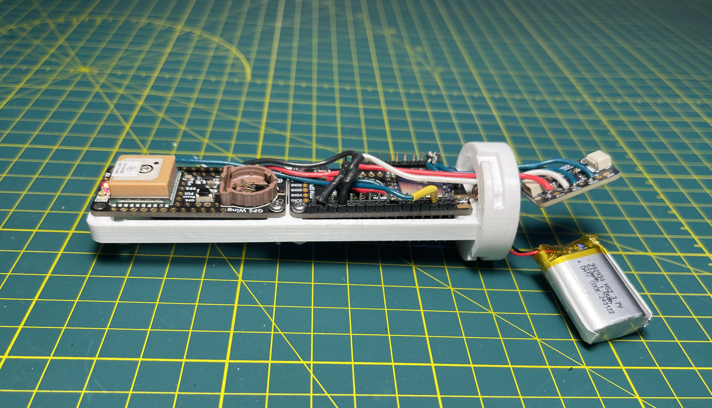

# adafruit-rocketry: lightweight drivers for a compact avionics system

this repository hold the software for my hobby rockets' avionics systems.

originally just contained the main code for the unified sensor driver (penguin)
(mostly just (1) the code for the onboard avionics/transmitter and (2) the code for the ground receiver)

now also has code for the chute release (initially developed elsewhere) and a GPS-over-LoRa test program I use for range testing antennas.

# hardware

the onboard avionics consist of:
- ~~Adafruit Feather M0 Express (<https://adafru.it/3403>)~~ *retired (read: lost in a field somewhere)*
- Adafruit Feather ESP32-S2 (<https://adafru.it/5000>)
- Adafruit ItsyBitsy (various boards) for chute release and newer altimeters
- Adafruit BMP390 Altimiter (<https://adafru.it/4816>)
- Adafruit BMP581 Altimiter (<https://adafru.it/6407>)
- Adafruit Ultimate GPS FeatherWing (<https://adafru.it/3133>)
- Adafruit RFM95W LoRa Radio FeatherWing (<https://adafru.it/3231>)
- *soon to be incorporated:* Adafruit ADXL375 200g High-G Accelerometer (<https://adafru.it/5374>)

and the ground reciever is just an Adafruit Feather M0 with integrated LoRa radio (<https://adafru.it/3178>).

# to-do
- chute-release/altimeter: add Cortex-M4 support (\_SAMD51\_ same ifdefs as \_SAMD21\_)
- chute-release/altimeter: collapse altimeter versions into one file with altimeter option
- chute-release/altimeter: safe, complete SPI flash writes on every log entry

# future ideas

- discrete SD card for reliability
- accelerometer data
- companion GUIs with Processing
- robotics and active control

